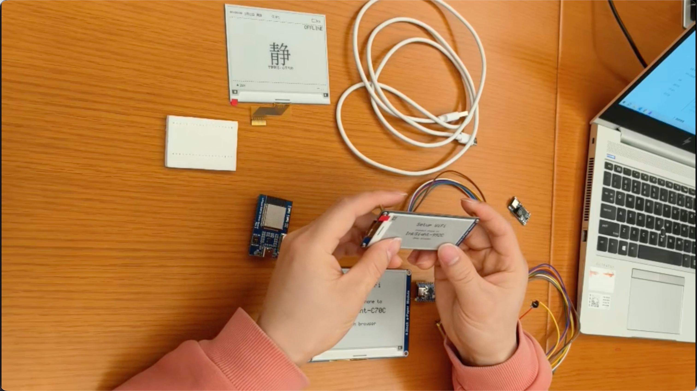

# InkSight

> 一款安静的水墨屏桌面助手，一个网站搞定固件烧录、配置、预览和模式发现。

官网：[https://www.inksight.site](https://www.inksight.site)


## 为什么选择 InkSight

InkSight 将一块小型水墨屏变成安静、始终可见的桌面信息面板。它不是又一个闪烁的通知流，而是以纸质感的方式呈现有用、美观、可定制的内容。

- **一目了然** — 天气、倒计时、备忘录、习惯、AI 简报、每日提示
- **专为桌面设计** — 纸质感水墨屏，长时间可见不伤眼
- **美观多样** — 24 种内置模式，从实用仪表盘到氛围内容
- **一站式网站体验** — 浏览器烧录、在线配置、实时预览、模式广场
- **开放可扩展** — 固件、后端、Web 配置、JSON 模式系统均可扩展

## 一站式网站

网站整合了完整的使用流程，即使你从未接触过水墨屏设备、ESP32 开发板或 WebSerial，跟着界面一步步走就能上手。

- **浏览器烧录** — 无需搭建本地环境，直接用 Web Flasher 烧录固件
- **在线配置** — 选择模式、偏好、刷新策略，逐模式覆盖参数
- **实时预览** — 保存前先看到水墨屏最终效果
- **无设备体验** — 还没买硬件也能走完完整流程
- **模式广场** — 发现和安装社区分享的创意模式

## 丰富模式库

InkSight 内置 **24 种模式**，包括：

- **每日精选** — 名言、书籍、趣味知识、季节内容
- **天气仪表盘** — 实时天气+实用建议
- **诗歌 / 禅意 / 斯多葛** — 适合专注工作的平静内容
- **AI 简报** — 科技动态和 AI 资讯
- **艺术墙** — 根据场景定制的黑白 AI 画作
- **备忘录 / 倒计时 / 习惯 / 健康** — 日常桌面工具

你还可以：

- **创建自定义模式**
- **保存到设备**
- **分享到模式广场**
- **安装社区模式**

## 推荐硬件

最佳搭配：

| 配件 | 推荐选择 |
|------|---------|
| MCU | ESP32-C3 开发板 |
| 屏幕 | 4.2 寸 SPI 水墨屏 |
| 供电 | 开发用 USB，可选锂电池（推荐 `505060-2000mAh` + TP5000） |
| 成本 | DIY 约 **CNY 220** |

详细采购方案见 [**硬件采购指南**](docs/en/bom.md)。

## 快速开始

### 组装设备



跟着视频一步步组装：[`组装教程`](https://www.bilibili.com/video/BV1spwKzUE6N)

文档说明：
- 硬件指南：[`docs/hardware.md`](docs/hardware.md)
- 组装指南：[`docs/assembly.md`](docs/assembly.md)
- 烧录指南：[`docs/flash.md`](docs/flash.md)
- 配置指南：[`docs/config.md`](docs/config.md)

### 刷入固件

固件烧录有两条路：

**方式一：官网 Web 烧录（推荐新手）**

访问 [https://www.inksight.site](https://www.inksight.site)，选择你的屏幕型号，用 Web Flasher 一键烧录。

**方式二：本地命令行烧录**

```bash
cd firmware
pio run -e <build_environment>
pio run -e <build_environment> --target upload
```

### 配置设备

固件运行后，设备会创建一个 AP，连接 `InkSight-XXXX` 并访问 `192.168.4.1` 配置 WiFi。配置好后就可以在官网设备页面管理了。

## 社区展示

感谢社区的精彩创作！

### 3D 打印外壳
- [**橙色桌面外壳 (MakerWorld)**](https://makerworld.com.cn/zh/models/2315926-gua-pei-inksight-4-2cun-zhi-neng-dian-zi-mo-shui-p#profileId-2617500)
- [**粉/红色简约外壳 (MakerWorld)**](https://makerworld.com.cn/zh/models/2319168-fu-ke-jiao-cheng-gua-pei-inksight-4-2cun-zhi-neng#profileId-2621798)

### 自定义 PCB
- [**InkSight 4.2" 自定义驱动板 (OSHWHUB)**](https://oshwhub.com/kidstory/4-2)

## 支持的屏幕面板

InkSight 支持多种 4.2 寸水墨面板，通过不同的编译环境切换：

### 4.2 寸黑白 (BW)
| 面板 | 编译环境 | 驱动 |
|------|---------|------|
| 微雪v2 SSD1683 (BW) | `epd_42_wsv2_ssd1683_c3_promini` | 软件 SPI |
| 中景园 SSD1683 (BW) | `epd_42_zhongjingyuan_bw_ssd1683_c3_promini` | 软件 SPI |
| Waveshare UC8176/IL0398 | `epd_42_waveshare_uc8176_c3_promini` | 硬件 SPI（Waveshare 官方驱动） |

### 4.2 寸三色 (BWR) — GxEPD2
| 面板 | 编译环境 |
|------|---------|
| 微雪v2 三色 GDEY042T81 | `epd_42_gxepd2_gdey042t81_ssd1683_c3_promini` |
| 微雪 IL0398 三色 | `epd_42_gxepd2_gdew042t2_il0398_c3_promini` |
| 微雪 UC8176 三色 | `epd_42_gxepd2_gdew042m01_uc8176_c3_promini` |
| 中景园 GYE042A87 三色 | `epd_42_zhongjingyuan_bw_gxepd2_gye042a87_c3_promini` |

### 编译命令
```bash
cd firmware
pio run -e <environment_name>
```

## 硬件接线定义

### ESP32-C3（标准接线）
| GPIO | 功能 | 说明 |
|------|------|------|
| GPIO6 | MOSI | SPI 数据输出 |
| GPIO4 | SCK | SPI 时钟 |
| GPIO7 | CS | 片选 |
| GPIO1 | DC | 数据/命令切换 |
| GPIO2 | RST | 复位 |
| GPIO10 | BUSY | 忙标志 |
| GPIO0 | BAT_ADC | 电池电压检测 |
| GPIO9 | CFG_BTN | 配置按钮 |
| GPIO3 | LED | 状态指示灯 |

### ESP32-WROOM32E
| GPIO | 功能 | 说明 |
|------|------|------|
| GPIO12 | MOSI | SPI 数据输出 |
| GPIO15 | SCK | SPI 时钟 |
| GPIO16 | CS | 片选 |
| GPIO11 | DC | 数据/命令切换 |
| GPIO10 | RST | 复位 |
| GPIO9 | BUSY | 忙标志 |
| GPIO35 | BAT_ADC | 电池电压检测 |
| GPIO0 | CFG_BTN | 配置按钮 |
| GPIO2 | LED | 状态指示灯 |

## 适配屏幕型号速查

| 型号 | 类型 | 分辨率 | 推荐编译环境 |
|------|------|--------|------------|
| **WFT0420CZ15LW**（微雪 4.2" 三色 V2） | 三色 BWR | 400×300 | `epd_42_gxepd2_gdew042m01_uc8176_c3_promini` |
| 微雪 4.2" 黑白 SSD1683 | 黑白 BW | 400×300 | `epd_42_wsv2_ssd1683_c3_promini` |
| 微雪 4.2" 三色 GDEY042T81 | 三色 BWR | 400×300 | `epd_42_gxepd2_gdey042t81_ssd1683_c3_promini` |
| 微雪 4.2" 三色 IL0398 | 三色 BWR | 400×300 | `epd_42_gxepd2_gdew042t2_il0398_c3_promini` |
| 中景园 4.2" 黑白 SSD1683 | 黑白 BW | 400×300 | `epd_42_zhongjingyuan_bw_ssd1683_c3_promini` |
| 中景园 4.2" 三色 GYE042A87 | 三色 BWR | 400×300 | `epd_42_zhongjingyuan_bw_gxepd2_gye042a87_c3_promini` |
| Waveshare UC8176/IL0398（通用） | 黑白 BW | 400×300 | `epd_42_waveshare_uc8176_c3_promini` |

> **新手推荐**：从微雪 4.2" 黑白 SSD1683 开始，生态最成熟，驱动最稳定。

## 部署自己的后端

如果你想自己部署或二次开发：

- 部署指南：[`docs/en/deploy.md`](docs/en/deploy.md)
- 架构说明：[`docs/en/architecture.md`](docs/en/architecture.md)
- API 文档：[`docs/en/api.md`](docs/en/api.md)
- 插件开发：[`docs/en/plugin-dev.md`](docs/en/plugin-dev.md)

## 社区

- Discord：[https://discord.gg/5Ne6D4YNf](https://discord.gg/5Ne6D4YNf)
- QQ 群：1026120682
- BiliBili：[https://www.bilibili.com/video/BV1nSNcziE7q/](https://www.bilibili.com/video/BV1nSNcziE7q/)


